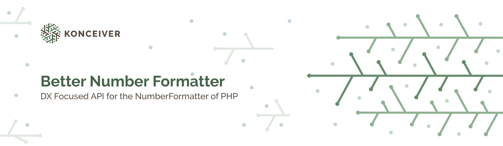

# Percentage

<p align="center"></p>

[](https://packagist.org/packages/konceiver/percentage)
[](https://packagist.org/packages/konceiver/percentage)
[](https://github.com/konceiver/percentage/actions?query=workflow%3Arun-tests+branch%3Amaster)
[](https://codeclimate.com/github/konceiver/percentage)
[](https://codeclimate.com/github/konceiver/percentage)
[](https://packagist.org/packages/konceiver/percentage)

This package is based on [mattiasgeniar/php-percentages](https://github.com/mattiasgeniar/php-percentages) and provides a fluent interface for percentage operations with PHP. It comes with support for PHP 8.0 and `SafePercentage` class which can be used in cases where you know a `Division by zero` exception could be thrown but you just want 0 to be returned in those cases.

## Installation

```bash
composer require konceiver/percentage
```

## Testing

``` bash
composer test
```

## Changelog

Please see [CHANGELOG](CHANGELOG.md) for more information on what has changed recently.

## Contributing

Please see [CONTRIBUTING](CONTRIBUTING.md) for details.

## Security

If you discover a security vulnerability within this package, please send an e-mail to security@konceiver.dev. All security vulnerabilities will be promptly addressed.

## Credits

This project exists thanks to all the people who [contribute](../../contributors).

## License

Better Number Formatter is an open-sourced software licensed under the [MIT](LICENSE.md).
